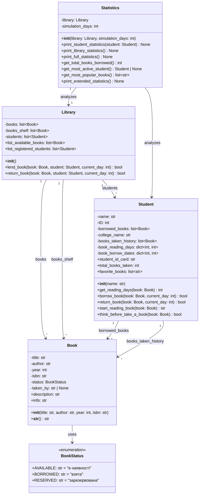

# UML Діаграма класів проекту "Бібліотека ІТ Коледжу"

## Опис класів та їх взаємозв'язків

### 1. **BookStatus** (Enumeration)
Перелік можливих статусів книги:
- `AVAILABLE` - книга доступна для позики
- `BORROWED` - книга взята студентом
- `RESERVED` - книга зарезервована

### 2. **Book**
Представляє книгу в бібліотеці:
- **Атрибути**: назва, автор, рік видання, ISBN, статус, хто взяв
- **Методи**: ініціалізація, строкове представлення, опис, інформація про статус
- **Зв'язок**: використовує `BookStatus`

### 3. **Student**
Представляє студента, який користується бібліотекою:
- **Атрибути**: ім'я, ID, поточні книги, історія взятих книг, статистика читання
- **Методи**: взяття/повернення книг, перегляд статистики, прийняття рішень
- **Зв'язки**: 
  - Має багато книг у позиці (`borrowed_books`)
  - Зберігає історію взятих книг (`books_taken_history`)

### 4. **Library**
Керує всією бібліотекою:
- **Атрибути**: каталог книг, доступні книги, список студентів
- **Методи**: видача/повернення книг, перегляд доступних ресурсів
- **Зв'язки**:
  - Управляє колекцією всіх книг (`books`)
  - Управляє книгами на полиці (`books_shelf`)
  - Реєструє студентів (`students`)

### 5. **Statistics**
Аналізує та виводить статистику роботи бібліотеки:
- **Атрибути**: посилання на бібліотеку, кількість днів симуляції
- **Методи**: виведення статистики, обчислення метрик
- **Зв'язки**: аналізує бібліотеку та студентів

## Ключові взаємодії

1. **Library ↔ Student ↔ Book**: Бібліотека видає книги студентам через методи `lend_book()` та `return_book()`
2. **Student → Book**: Студент зберігає посилання на взяті книги та історію
3. **Statistics → Library**: Статистика аналізує дані бібліотеки та студентів
4. **Book → BookStatus**: Кожна книга має статус з переліку

## Типи зв'язків

- **Композиція** (◆): Library містить списки Student та Book
- **Асоціація** (→): Student працює з Book, Statistics аналізує Library
- **Залежність** (- - →): Book використовує BookStatus
