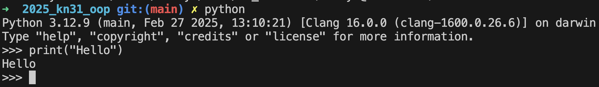

# Вчимося працювати з Markdowd
## Пробуємо форматувати текст
Цей текст можу бути нескіченним та ми можемо писати багато чого в єдиній стрічці
а тут я захотів вставити код  
Цей тест після двох __пробілів__ буде вже на новій стрічці.  

Або ми можемо *просто **залишити*** одну стрічку вільною

Ми ~~байдикуємо~~ **_вчимось_** на "парах"

## Тут пробуємо використати структури або списки
1. Ми почали вичтись форрматуванню тексту
3. цей пункт був 3 але ми його поставили сюди
    - тут всаляємо підсписаок з додакковою інформацією
    + чи ставимо +
    * ви використовуємо зірочку
1. Цей пункт всавлявся пізніше
2. Пройши декільки варіантів використання Markdown
1. Найчастіше всі пункти ставляться 1

[Переходимо на початок файлу](#вчимося-працювати-з-markdowd)

[Перехід на головну сторінку файл README](../README.md)

- Ми запустили Python та виконали наш перший код 